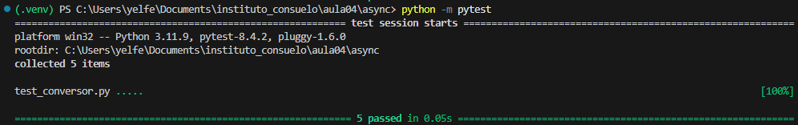

## Projeto: Conversor de Temperaturas com Testes em Python

Este projeto consistiu no desenvolvimento de um módulo em Python (`conversor.py`) para converter temperaturas entre as escalas Celsius, Fahrenheit e Kelvin. Foram implementadas funções para realizar os cálculos de conversão e garantir a robustez dos dados de entrada.

Para garantir a precisão dos cálculos, foi criada uma suíte de 5 testes automatizados (`test_conversor.py`) com o framework `pytest`. Os testes validaram as conversões em diferentes cenários, confirmando que as funções se comportam como o esperado.

### Resultado da Execução dos Testes

O comando `python -m pytest` foi executado na pasta do projeto. O resultado abaixo confirma que todos os 5 testes passaram com sucesso.

