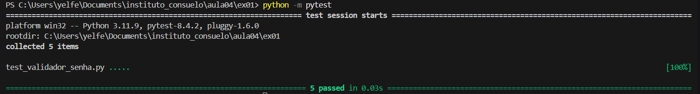

## Projeto: Validador de Senha em Python com Testes

Este projeto consistiu no desenvolvimento de uma função em Python (`validador_senha.py`) para validar a força de senhas, seguindo um conjunto de regras: mínimo de 8 caracteres, e a inclusão de letras maiúsculas, minúsculas, números e caracteres especiais.

Para garantir a qualidade da função, foi criada uma suíte de testes automatizados (`test_validador_senha.py`) com o framework `pytest`. Os testes cobriram todos os cenários de falha e um cenário de sucesso, confirmando que a função se comporta como o esperado.

### Resultado da Execução dos Testes

O comando `python -m pytest` foi executado na pasta do projeto, e o resultado abaixo confirma que todos os 5 testes passaram com sucesso.

